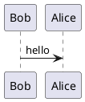

# PUML Viewer for Obsidian

A plugin for Obsidian that renders PlantUML from `.puml` files and markdown code blocks.

## Features

- Custom `.puml` view with two modes:
  - `View` (diagram)
  - `Edit` (source code with line numbers)
- `.puml` toolbar actions:
  - refresh
  - zoom in / reset / zoom out
  - export buttons (SVG icons) to save as:
    - `.png`
    - `.svg`
    - `.txt` (ASCII Art)
- Drag-to-pan in `.puml` diagram view when content is scrollable
- Auto-fit diagram to viewer width on render
- Auto-refresh on source file change
- Startup recovery: reopen and render previously opened `.puml` after Obsidian restart
- Markdown embedded rendering for fenced blocks:
  - ` ```plantuml `
  - switch between `View Code` and diagram
  - `Zoom` overlay with drag-to-pan and zoom controls
  - save diagram with format chooser (`Save as PNG` / `Save as SVG`)
  - optional width hint in fence: ` ```plantuml |500 `
  - width hint limits only diagram area; code view uses full available block width
- PlantUML code coloring in embedded `View Code` mode
- Works with:
  - PlantUML server
  - Kroki (`https://kroki.io`)
  - Local server (for example `http://localhost:8000`)
- Supports both `SVG` and `PNG`

## Build

```bash
npm install
npm run build
```

## Install into Obsidian

Copy these files into:

```text
<YourVault>/.obsidian/plugins/puml-viewer/
```

Files:
- `main.js`
- `manifest.json`
- `styles.css`
- `versions.json`

Then enable the plugin in **Settings → Community plugins**.

## Usage

### Open `.puml` files

- Open a `.puml` file and run command:
  - `Open current PUML in viewer`
- Switch between `View` and `Edit` modes in the toolbar.

### Markdown blocks

Basic block:



Block with width hint:


- `|500` means max diagram block width in pixels.
- In rendered block, use:
  - `View Code` to toggle source/diagram
  - `Zoom` to open fullscreen overlay
  - save icon to choose `PNG` or `SVG`

## Settings

- `Server type`: `PlantUML` / `Kroki` / `Local`
- Separate URLs:
  - `PlantUML URL` (example: `https://www.plantuml.com/plantuml`)
  - `Kroki URL` (example: `https://kroki.io`)
  - `Local URL` (example: `http://localhost:8000`)
- `Image format`: default render format for viewer (`SVG` or `PNG`)
- `Embedded block default view`: show diagram or code first
- `Embedded diagram alignment`: `left` / `center` / `right` (default `center`)
  - Applied immediately in markdown preview without Obsidian restart
